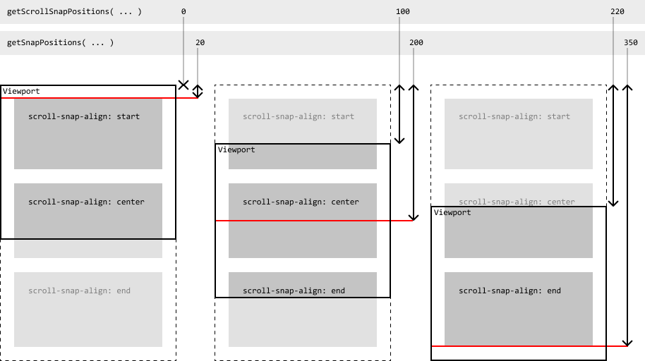

# scroll-snap-api

Interact with [CSS scroll-snap](https://developer.mozilla.org/en-US/docs/Web/CSS/CSS_Scroll_Snap).

## Install

```shell
yarn add scroll-snap-api

npm install --save scroll-snap-api
```

Or import directly

```js
import * as scrollSnapApi from 'https://cdn.pika.dev/scroll-snap-api';
```

## Usage

### Scroll an element to the next snap position in a direction

```js
import { scrollSnapToNext } from 'scroll-snap-api';

scrollSnapToNext( scrollingElement, 'right' ); // 'left', 'right', 'up', 'down'
```

### Get the possible scroll positions

```js
import { getScrollSnapPositions } from 'scroll-snap-api';

const scroll = getScrollSnapPositions( scrollingElement );

/*
{
  x: [ 0, 100, 150, 200 ],
  y: [ 0, 200, 400, 600, 800 ],
}
*/
```

### Get the raw snap positions

Note: these are not scroll positions.

```js
import { getSnapPositions } from 'scroll-snap-api';

const snap = getSnapPositions( scrollingElement );

/*
{
  x: {
    start: [ 0, 100 ],
    center: [ 300 ],
    end: [ 500 ],
  },
  y: {
    start: [ 0 ],
    center: [ 250, 500, 750 ],
    end: [ 1000 ],
  },
}
*/
```



## TODO

- More documentation
- Support `dir="rtl"`
